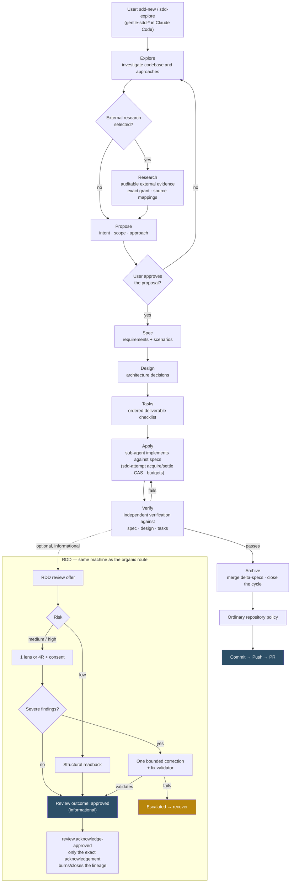
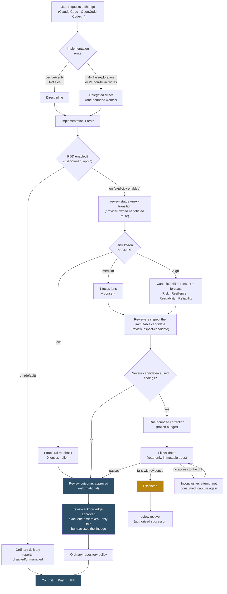

<div align="center">


<h1>Gentle-AI™</h1>

<p><strong>Turn the AI coding agent you already use into a configured engineering environment.</strong></p>

<p>
<a href="https://github.com/Gentleman-Programming/gentle-ai/releases"></a>
<a href="LICENSE"></a>


</p>

<p>
<a href="https://gentlemanprogramming.com/"><strong>Website</strong></a> &bull;
<a href="https://gentle-ai-wiki.gentlemanprogramming.com/"><strong>Wiki</strong></a> &bull;
<a href="https://engram.gentlemanprogramming.com/"><strong>Engram</strong></a>
</p>

<!--
  sealed_token is a GitHub fine-grained token encrypted against Star History's
  public key, so only the encrypted value is published here. It is required
  because GitHub restricted the stargazers API to a repository's admins and
  collaborators on 2026-06-30; without it the chart renders an error placeholder.
  Regenerate it at https://www.star-history.com/?repos=Gentleman-Programming%2Fgentle-ai&type=date&legend=top-left
-->

<a href="https://www.star-history.com/?repos=Gentleman-Programming%2Fgentle-ai&type=date&legend=top-left">
  <picture>
    <source media="(prefers-color-scheme: dark)" srcset="https://api.star-history.com/chart?repos=Gentleman-Programming%2Fgentle-ai&type=date&theme=dark&legend=top-left&sealed_token=zwrd_DfwYZeJU7nhGYNtREEheKWYEslW_uzrqORlZ36v-JSMepdqGLkKExp1M-xbNq6t-ebVS5iM3WoPDO26tXbSGkjXC2Jo3kHQ3uNzlRkCrWoqRHkPVQXvosKciY109ObiwGV1z8aajyedcloppmekCGrvVKJb6KWxGLXW_mHcRAVIBZUOa4SzW75D" />
    <source media="(prefers-color-scheme: light)" srcset="https://api.star-history.com/chart?repos=Gentleman-Programming%2Fgentle-ai&type=date&legend=top-left&sealed_token=zwrd_DfwYZeJU7nhGYNtREEheKWYEslW_uzrqORlZ36v-JSMepdqGLkKExp1M-xbNq6t-ebVS5iM3WoPDO26tXbSGkjXC2Jo3kHQ3uNzlRkCrWoqRHkPVQXvosKciY109ObiwGV1z8aajyedcloppmekCGrvVKJb6KWxGLXW_mHcRAVIBZUOa4SzW75D" />
    
  </picture>
</a>

</div>

---

## What is Gentle-AI?

You installed Claude Code, OpenCode, Cursor or Codex. It writes code — but it forgets everything between sessions, has no opinion about how your project works, and gives you no way to check its work beyond reading every line yourself.

**Gentle-AI is an ecosystem configurator.** It takes the agent runtime already on your machine and equips it with persistent memory, a planning workflow, a curated skill library, MCP tool servers, model routing, a teaching-oriented persona, and an optional evidence-based review step.

| | |
| --- | --- |
| **Before** | "I installed an AI agent, but it's just a chatbot that writes code." |
| **After** | The agent remembers your decisions, follows your project's conventions, picks a working style that matches the size of the task, and can produce reviewable evidence for what it changed. |

### Who it's for

- Developers who **already use an AI coding agent daily** and want it to stop starting from zero.
- Teams that want **consistent agent behavior** across different agent runtimes and machines.
- Anyone who wants to **verify** what an agent did instead of trusting its summary.

### What it is not

Gentle-AI **never installs an AI agent for you.** It configures runtimes that are already present. If you select an agent it cannot detect, it refuses and prints the exact command you'd run yourself — it will not silently install software on your machine.

---

## What you get

Gentle-AI installs a set of **components**. You pick them individually, or take a preset.

| Component | What it gives your agent | Essential? |
| --- | --- | --- |
| **Engram™** | Persistent memory across sessions — decisions, bug fixes, and context survive restarts | Recommended |
| **Skills** | A curated library of coding skills the agent loads when the task matches | Recommended |
| **Persona** | A teaching-oriented voice (Gentleman or neutral), or your own custom persona | Optional |
| **SDD** | Spec-Driven Development — a planning workflow for substantial features | Optional |
| **Context7** | An MCP server that fetches live framework and library documentation | Optional |
| **Permissions** | Security-first guardrails, including a deny list for `~/.ssh`, `.env`, and credential files | Optional |
| **GGA** | Gentleman Guardian Angel — an AI provider switcher | Optional |
| **Theme** | Selectable Gentleman and Gentleman-Cute themes for Claude Code and OpenCode | Optional |

Presets bundle these for you:

| Preset | Includes |
| --- | --- |
| **Dev Stack + Polish** (`full-gentleman`) | Every component and every skill |
| **Dev Stack** (`ecosystem-only`) | Engram, SDD, Skills, Context7, GGA + all skills |
| **Memory Only** (`minimal`) | Engram and SDD skills |
| **Custom** | You choose; existing persona and settings stay untouched |

Full breakdown: [Components, Skills & Presets](docs/components.md).

---

## Which agents it works with

Gentle-AI configures each agent using that agent's own native features, so capabilities differ. **Delegation model** tells you whether the agent can hand work to focused sub-agents or runs everything in one conversation.

| Agent | Delegation model | Key feature |
| ------------------- | :------------------------------: | --------------------------------------------------------------- |
| **Claude Code**     |         Full (Task tool)         | Sub-agents, output styles                                       |
| **OpenCode**        |    Full (multi-mode overlay)     | Per-phase model routing                                         |
| **Kilo Code**       |    Full (multi-mode overlay)     | OpenCode-compatible config in `~/.config/kilo`                  |
| **Gemini CLI**      |       Full (experimental)        | Custom agents in `~/.gemini/agents/`                            |
| **Cursor**          |     Full (native subagents)      | 10 SDD agents in `~/.cursor/agents/`                            |
| **VS Code Copilot** |        Full (runSubagent)        | Parallel execution                                              |
| **Kimi Code**       |   Full (native custom agents)    | Modular prompt templates in `~/.kimi`                           |
| **Kiro IDE**        |     Full (native subagents)      | Native `~/.kiro/agents/` + steering orchestration               |
| **Qwen Code**       |     Full (native sub-agents)     | Slash commands, `~/.qwen/commands/`, `auto_edit` mode           |
| **Pi**              | Full (package-managed subagents) | First-class `gentle-pi` harness with Pi-native persona/models, SDD, and Engram memory |
| **Codex**           |            Solo-agent            | CLI-native, TOML config                                         |
| **Windsurf**        |            Solo-agent            | Plan Mode, Code Mode, native workflows                          |
| **Antigravity**     |   Solo-agent + Mission Control   | Built-in Browser/Terminal sub-agents                            |
| **OpenClaw**        |            Solo-agent            | Workspace-first `AGENTS.md` / `SOUL.md` with global MCP config  |
| **Trae**            |            Solo-agent            | Desktop app by ByteDance; `~/.trae/skills/` + OS-specific rules |
| **Hermes**          |           Detect-only            | YAML MCP config, SOUL.md persona; install manually first        |

> **Pi is package-managed, not just configured.** Selecting Pi installs the first-class [`gentle-pi`](docs/pi.md) harness, which owns Pi-native persona and model controls, SDD assets, chains, and memory wiring.

> **Note**: This project supersedes [Agent Teams Lite](https://github.com/Gentleman-Programming/agent-teams-lite) (now archived). Everything ATL provided is included here with better installation, automatic updates, and persistent memory.

Per-agent details and the complete feature matrix: [Agents](docs/agents.md).

---

## Install

### Step 1 — Check prerequisites

| Requirement | Why |
| --- | --- |
| **Node.js 18+ and npm** | Required by `gentle-ai install` on every platform. It warns if either is missing and prints a distro-specific hint — it does not install them for you. |
| **Git 2.38+** | Used for project detection and review scoping. |
| **Go 1.25.10+** | Required on Windows, and anywhere you install from source. |
| **Your AI agent** | Already installed and on your `PATH`. Gentle-AI configures it; it does not install it. |

Per-distro hints: [Prerequisites](docs/quickstart.md#prerequisites).

### Step 2 — Install the binary

**macOS / Linux**

```bash
curl -fsSL https://raw.githubusercontent.com/Gentleman-Programming/gentle-ai/main/scripts/install.sh | bash
```

**Windows (PowerShell)**

```powershell
go install github.com/gentleman-programming/gentle-ai/v2/cmd/gentle-ai@latest
```

> [!WARNING]
> **On Windows, install from source — this is the supported path.** Windows is a fully tested platform — the complete suite runs on its CI lane — but official Windows binary distribution and Scoop are unavailable. Windows installation and upgrades require Go 1.25.10+ and fail closed to source-install guidance; they never download an unsigned Gentle AI executable or execute a remote update script.

**Expected result:** `gentle-ai version` prints a version number.

### Step 3 — Configure your agents

Launch the interactive TUI:

```bash
gentle-ai
```

Select your agent(s), your components (or a preset), and your persona.

**Expected result:** Gentle-AI writes config files into each selected agent's global config directory — system prompts, skills, SDD agents, persona files and MCP entries. Your previous configs are snapshotted first (see [Backups](#backups)).

### Step 4 — Verify

```bash
gentle-ai doctor
```

**Expected result:** a read-only health report covering tool binaries, `state.json`, Engram reachability and disk space. It also classifies broken managed paths — dangling ancestor symlinks, config symlink loops and unreadable managed files. Nothing is modified. Run this any time something looks wrong.

You are now ready to use your agent normally.

---

## Your first project

Open your AI agent inside a project and start working. **That's it** — no phases to memorize, no config to hand-edit.

Two optional commands give the agent richer project context:

| Command | What it does | When to re-run |
| --- | --- | --- |
| `/gentle-sdd-init` (Claude Code) | Detects your stack and testing capabilities; activates Strict TDD Mode if your project supports it | When the project adds or removes test frameworks, or the first time in a new project |
| `/sdd-init` (other runtimes) | Runs the same project initialization through the runtime's SDD command | Same as above |
| `gentle-ai skill-registry refresh` | Scans installed skills and project conventions, then builds the registry | After installing or removing skills, or the first time in a new project |

Neither initialization command is required. SDD orchestration runs the runtime-appropriate command when it finds no project context, and startup hooks normally keep the skill registry fresh for agents that support them (Codex, Claude Code, OpenCode, and Pi via `gentle-pi`). If you start Pi with `pi -ns`, startup hooks are skipped — refresh the registry manually when you need updated project rules.

---

## How your agent decides how to work

This is the core idea, and it applies to **every** configured agent — even if you never enable SDD or review.

**You ask for an outcome. The agent picks the smallest route that gets there.** It does not escalate ceremony because a task "feels big".

| Situation | What the agent does |
| --- | --- |
| Understanding needs 1–3 files, or one mechanical change is already understood | **Direct inline** — just does the work |
| Understanding needs 4+ files, reading prepares a write, broad research is needed, or 2+ non-trivial files change | **Delegated direct** — one narrow explorer or one focused writer, no extra artifacts |
| Durable proposal, spec, design and task artifacts would materially reduce real ambiguity | **Offers optional SDD** — selected only after you ask or accept the proposal |
| Commit, push, PR, or release | Follows ordinary repository policy |

Three rules worth internalizing:

- **Size never selects SDD.** File count, changed lines and perceived risk never force the heavier route on their own. Only an explicit request or an accepted proposal does.
- **Routing does not decide review strength.** They are independent choices.
- **Per-action workers don't change the route.** Running tests, builds or installs in a fresh worker keeps the selected route intact.

Deep dive: [Organic Implementation Routing](docs/trigger-rules.md).

---

## Optional: Spec-Driven Development (SDD)

### What it is

SDD is a **planning workflow for substantial features.** Instead of jumping straight into code, the agent explores the codebase, proposes an approach you approve, writes requirements, designs the architecture, breaks it into ordered tasks, implements, then independently verifies the result against what was agreed.

### When you'd want it

When the work is ambiguous enough that durable written artifacts — a proposal, a spec, a design, a task list — would genuinely reduce that ambiguity. For a bug fix or a small feature, it's overhead.

### How you use it

You don't learn the phases. Say *"use SDD"* and the agent starts the workflow, or accept it when the agent offers. You review and approve at the decision points.

In Claude Code, every SDD command uses the `/gentle-sdd-*` prefix — for example, `/gentle-sdd-new` and `/gentle-sdd-continue`. Other runtimes keep the bare `/sdd-*` names.

SDD artifacts can live in three places, chosen at install time:

| Store | Best for |
| --- | --- |
| **Engram** | Cross-session memory, no files in the repo |
| **OpenSpec** | Versioned files committed alongside your code |
| **Hybrid** | Both |

The store you declare is authoritative: phase agents are handed the locations to read and never guess where artifacts live.

Immediately after Explore, you can select **SDD Research** when the proposal needs external evidence. This optional lane requires an exact documentation or open-web grant and records auditable evidence with source mappings. Once selected, Research must finish before Propose.

When Strict TDD is active, SDD apply works test-first, and SDD verify audits the RED/GREEN evidence before it passes.

SDD status v2 runtime state is independent from review. No review binding, receipt or gate controls SDD Archive or delivery; ordinary repository policy remains authoritative for delivery.

<details>
<summary><strong>How the SDD cycle works internally</strong></summary>



</details>

Reference: [Intended Usage](docs/intended-usage.md) and [OpenSpec Config](docs/openspec-config.md).

---

## Optional: Receipt-Driven Development (RDD)

> [!IMPORTANT]
> **RDD is opt-in and off by default.** Nothing below happens until you run `gentle-ai review mode enable --scope global`.

### The problem it solves

An agent tells you "I fixed it and the tests pass." You have no way to check that claim except reading the whole diff yourself. RDD replaces agent narration with **evidence the system can derive independently.**

### The vocabulary

You need six terms. Each builds on the last:

| Term | Meaning |
| --- | --- |
| **Candidate** | The exact set of bytes being reviewed — one specific change, nothing else |
| **Freeze** | Locking those bytes at the start, so reviewers and the code can't drift apart mid-review |
| **Lens** | One focused reviewer perspective. The four canonical ones are **Risk**, **Resilience**, **Readability** and **Reliability** ("4R") |
| **Correction** | At most **one** bounded round of fixes for severe findings — there is no loop-until-clean |
| **Outcome** | The result of the review. It is **informational**: it records evidence, it does not authorize or block anything |
| **Acknowledgement** | The explicit confirmation that your agent *received* the outcome. Until it runs, the review is approved but not finished |

### What it actually does

Once implementation finishes, RDD freezes the candidate and picks review effort **from evidence, not from size**:

| Risk (frozen at start) | Review performed |
| --- | --- |
| Low | Structural readback — 0 lenses, silent. A passive documentation change is approved right at the start |
| Medium | 1 focus lens, with consent |
| High | All four lenses (4R), with consent and a cost forecast |

If reviewers find severe findings caused by the candidate itself, RDD permits one bounded correction, then a read-only validator checks it. Pre-existing findings become follow-ups, not blockers.

### Approval waits to be acknowledged

**In stable `v2.5.0`, a review does not end when it is approved.** It ends when your agent confirms it received that approval.

Why this exists: previously, approval destroyed its own authority and returned a response. If that response never reached the host — a crash, a dropped connection — the review was over and nothing said so.

Final approval creates an exact `review.acknowledge-approved` operation carrying a one-time token. Only running that exact acknowledgement burns/closes the lineage. This is handled by your agent, not typed by you, but it explains two behaviors you may notice:

- **Re-entering a review is safe.** Asking for status again returns the same operation, arguments, token and revision — it does not start a new review.
- **A stale or repeated acknowledgement is refused** and leaves no successor lineage or partial state.

If a host decodes the acknowledgement but never runs it, the review stays approved and cannot be closed — by design, rather than silently vanishing.

### The review hands back its own next command

Re-entering a frozen review used to be described in prose, which could drift from what the CLI accepted.

**Stable `v2.5.0` carries that knowledge in the protocol instead of prose.** A negotiated START returns a `gentle-ai.review-integration.start/v4` envelope whose `next_transition` contains the complete command that re-enters the transaction. Your agent runs it verbatim rather than reconstructing it.

The practical rule, and the one worth knowing even if you never read an envelope: **the agent should run the command the provider returned, never one assembled from a description of it.** You can check which protocol version your build speaks with:

```bash
gentle-ai review capabilities --contract gentle-ai.review-integration/v2
```

### The line that matters

**Review never governs delivery.** Commit, push, PR and release stay separate human decisions under your ordinary repository policy — whether RDD is on or off. When it's off, delivery reports `disabled/unmanaged`; it never fabricates an approval.

### Turning it on and off

From the command line:

```bash
gentle-ai review mode status  --cwd .   # read-only; changes nothing
gentle-ai review mode enable --scope global --cwd .
gentle-ai review mode disable --cwd .
```

Or from the interactive TUI: run `gentle-ai` and open **Receipt-Driven Development**, which offers the same global controls.

Rules worth knowing:

- With no source expressing an opinion, the effective mode is `off`, reported as decided by `default`.
- **Off always wins.** Any global or clone-local disabled source turns review off.
- A clone can opt out with `--scope clone`, but **cannot force review on**. `--scope global` is the only way in.
- Enabling applies to **future** candidates only. Declining a single review prompt does not change the mode.
- `--scope global` works from any directory, including one that is not a Git repository. A workspace that is not versioned yet gets a local Git bootstrap before its first review, rather than a refusal.

<details>
<summary><strong>How the review lifecycle works internally</strong></summary>

The organic route, with RDD entering at the end over the frozen candidate:



Native review transitions own repository identity, candidate scope, lifecycle transitions and safe continuations. When scope changes or an operation is interrupted, use provider-owned status and recovery — never infer authority from agent narration. Compact receipts, `FINALIZE` and delivery gates are retired. Historical compatibility reads may remain, but they never regain authority; `review validate` and gate compatibility surfaces are unmanaged and never govern delivery.

Technical references: [Organic RDD architecture](docs/architecture/organic-rdd.md), [Review Authority Threat Model](docs/review-authority-threat-model.md), [Review Integration Contract](docs/review-integration.md).

</details>

> **The mental model in one sentence:** trust what the system can derive, not what the agent says. [Chapter 21 — Verifiable Trust](https://the-amazing-gentleman-programming-book.vercel.app/en/book/Chapter21_Verifiable-Trust) explains why.

---

## Keeping it up to date

Refresh the binary and its managed agent assets **together**:

```bash
gentle-ai upgrade
gentle-ai sync
```

> [!IMPORTANT]
> `sync` is not optional after an upgrade. If you replace the `gentle-ai` binary by any means, run `gentle-ai sync` to refresh the managed assets it writes into your agents. See the [sync and upgrade reference](docs/usage.md#sync).

### Backups

Every install, sync and upgrade automatically snapshots your config files. Backups are **compressed** (tar.gz), **deduplicated** (identical configs are not re-backed up) and **auto-pruned** (the 5 most recent are kept). Pin important backups via the TUI (`p` key) to protect them from pruning.

Restoring a snapshot: [Backup & Rollback Guide](docs/rollback.md).

---

## Reference

<details>
<summary><strong>Release channels and version policy</strong></summary>

There are two current channels. Install `@latest` unless you are deliberately testing unreleased development code.

| Channel | Current | Install |
| --- | --- | --- |
| **Stable** | [`v2.5.0`](https://github.com/Gentleman-Programming/gentle-ai/releases/tag/v2.5.0) | `go install github.com/gentleman-programming/gentle-ai/v2/cmd/gentle-ai@latest` |
| **Development** | `main` | `go install github.com/gentleman-programming/gentle-ai/v2/cmd/gentle-ai@main` |

Verify with `gentle-ai version` after any of them.

Use `@main` only to test changes that are not part of a release. The managed installer tracks a channel's latest version and does not accept an arbitrary release pin — use `go install` when you need an exact version.

**About the `/v2` suffix:** Go requires it for major version 2 and above. Releases before `v2.0.0` use the unsuffixed import path.

**Stable `v2.5.0` publishes six archives under a signed checksum manifest:** four platform `.tar.gz` archives for macOS and Linux (amd64 and arm64), the provider-contract archive, and the release-provenance archive. `checksums.txt` covers all six and is authenticated by `checksums.txt.minisig`.

Receipt-Driven Development became the supported stable path in `v2.2.0`; the negotiated public review contract was published in `v2.1.6`.

</details>

<details>
<summary><strong>Alternative install methods</strong></summary>

**Homebrew (macOS / Linux)**

```bash
brew tap gentleman-programming/tap
brew trust --formula gentleman-programming/tap/gentle-ai  # one-time, if Homebrew requires trust
brew install gentle-ai
```

To install several tools from this tap, run `brew trust gentleman-programming/tap` instead. That broader option trusts all current and future formulas, casks and external commands published in the tap.

**Scoop (Windows)** — temporarily unavailable while official Windows binary distribution is held for public-trust Authenticode signing. Use the Windows `go install` command above.

**Beta channel (tracks `main`)** — requires Go 1.25.10+:

```bash
# macOS / Linux
curl -fsSL https://raw.githubusercontent.com/Gentleman-Programming/gentle-ai/main/scripts/install.sh | bash -s -- --channel beta

# Windows (PowerShell)
$env:GENTLE_AI_CHANNEL="beta"; go install github.com/gentleman-programming/gentle-ai/v2/cmd/gentle-ai@main
```

To update a beta installation later, preserve the channel — both installers default to stable:

```bash
# macOS / Linux
GENTLE_AI_CHANNEL=beta gentle-ai upgrade

# Windows (PowerShell)
$env:GENTLE_AI_CHANNEL="beta"; gentle-ai upgrade
```

If a manual `go install ...@main` does not pick up recent commits because `proxy.golang.org` is stale, bypass it:

```bash
GOPROXY=direct go install github.com/gentleman-programming/gentle-ai/v2/cmd/gentle-ai@main
# PowerShell
$env:GOPROXY="direct"; go install github.com/gentleman-programming/gentle-ai/v2/cmd/gentle-ai@main
```

</details>

<details>
<summary><strong>Installing to one project instead of globally</strong></summary>

By default, `gentle-ai install` writes agent-scoped files to each selected agent's **global** config directory. To keep the Gentleman stack isolated to a single project:

```bash
gentle-ai install --scope=workspace
```

Workspace scope covers agent-scoped files — system prompts, skills, SDD agents and persona files. Global-only integrations remain global by design.

</details>

<details>
<summary><strong>Verifying a release signature manually</strong></summary>

**Stable channel — Minisign.** Stable `v2.5.0` publishes six archives: four macOS/Linux platform archives, the provider-contract archive, and the release-provenance archive. All six are covered by an authenticated `checksums.txt`. The built-in upgrader verifies its Minisign signature, its exact `Gentleman-Programming/gentle-ai` + release-tag binding, and the selected platform archive checksum **before** replacing the installed binary. Release archives are capped at **128 MiB**, including chunked or unknown-length responses. Missing, oversized, malformed, untrusted or placeholder key material fails closed without changing the installed binary.

To verify yourself, obtain the production public-key payload and fingerprint from a maintainer-controlled channel, then download `checksums.txt` and `checksums.txt.minisig` from the same release:

```bash
minisign -VQm checksums.txt -x checksums.txt.minisig -P "$GENTLE_AI_MINISIGN_PUBLIC_KEY"
# Expected output: repo=Gentleman-Programming/gentle-ai;tag=vX.Y.Z
sha256sum --check --strict --ignore-missing checksums.txt
```

Do not bootstrap trust from a public key downloaded only beside the artifacts it verifies. See [Release signing and key rotation](docs/release-signing.md).

**Provider contract bundle.** Stable `v2.5.0` publishes `gentle-ai-review-provider-contract-1.1.0.tar.gz`. Verify and inspect it from the tagged source:

```bash
go run ./internal/providercontractbundlecmd verify --archive <bundle>
tar -tzf <bundle>
```

**Release provenance bundle.** `gentle-ai-release-provenance-v1.tar.gz` carries the stable release provenance materials and is covered by the same signed checksums.

</details>

<details>
<summary><strong>Reviewing only what is staged (monorepos)</strong></summary>

In a monorepo or shared worktree, review exactly what is in the Git index:

```bash
git add apps/my-service
git diff --cached
gentle-ai review start --projection staged
```

The staged projection freezes the **complete existing index**, including paths staged earlier. It starts a review but does not itself produce an approved outcome or authorize delivery; unstaged and untracked worktree content is excluded. The default `workspace` projection reviews the complete workspace, and an existing authority is never auto-converted between projections.

Details: [review authority threat model](docs/review-authority-threat-model.md).

</details>

<details>
<summary><strong>OpenCode: assigning different models per SDD phase</strong></summary>

Use a powerful model for design, a fast one for implementation, a cheap one for exploration. OpenCode uses **`gentle-orchestrator`** as the base SDD conductor; generated named profiles appear as `sdd-orchestrator-{name}`.

```bash
# Via CLI
gentle-ai sync --profile cheap:openrouter/qwen/qwen3-30b-a3b:free
gentle-ai sync --profile-phase cheap:sdd-design:anthropic/claude-sonnet-4-20250514

# Or via TUI: gentle-ai → "OpenCode SDD Profiles" → Create
```

After creating a profile, open OpenCode and press **Tab** to switch between `gentle-orchestrator` and your custom profiles.

| What you need | Use this |
| --- | --- |
| Default SDD conductor | `gentle-orchestrator` |
| Legacy configs | `sdd-orchestrator` is migrated to `gentle-orchestrator` on sync |
| Named model profiles | `sdd-orchestrator-cheap`, `sdd-orchestrator-premium`, etc. |

Full guide: [OpenCode SDD Profiles](docs/opencode-profiles.md).

</details>

<details>
<summary><strong>Using Engram memory from the terminal</strong></summary>

Your agent manages memory automatically — you don't need these. But when you want to look:

```bash
engram projects list          # See all projects with memory counts
engram projects consolidate   # Fix name drift ("my-app" vs "My-App")
engram search "auth bug"      # Find a past decision from the terminal
engram tui                    # Visual memory browser
engram sync                   # Export project memories to .engram/ for git tracking
engram sync --import          # Import memories after cloning a repo with .engram/
```

Full reference: [Engram Commands](docs/engram.md).

</details>

<details>
<summary><strong>Command reference</strong></summary>

```bash
gentle-ai                     # Launch the interactive TUI
gentle-ai install             # Configure AI coding agents on this machine
gentle-ai uninstall           # Remove Gentle AI managed files
gentle-ai sync                # Sync agent configs and skills to the current version
gentle-ai update              # Check for available updates
gentle-ai upgrade             # Apply updates to managed tools
gentle-ai restore             # Restore a config backup
gentle-ai doctor              # Run ecosystem health diagnostics
gentle-ai version             # Print version
gentle-ai skill-registry refresh
gentle-ai review mode <enable|disable|status>
gentle-ai review capabilities --contract gentle-ai.review-integration/v2
```

Run `gentle-ai help` for the complete surface, including SDD orchestration and review lifecycle subcommands.

</details>

---

## Documentation

| Your task | Start here |
| --- | --- |
| Understand the Gentle-AI mental model | [Intended Usage](docs/intended-usage.md) |
| Choose direct, delegated, or optional SDD routing | [Organic Implementation Routing](docs/trigger-rules.md) |
| Plan substantial work with SDD | [Intended Usage](docs/intended-usage.md) and [OpenSpec Config](docs/openspec-config.md) |
| Configure a supported agent | [Agents](docs/agents.md) for the feature matrix and per-agent notes |
| Use the Pi package harness | [Pi Agent](docs/pi.md) for packages, Pi-native commands, models, and troubleshooting |
| Configure OpenCode phase models | [OpenCode SDD Profiles](docs/opencode-profiles.md) |
| Review or deliver a change safely | [Review Integration Contract](docs/review-integration.md), [Review Authority Threat Model](docs/review-authority-threat-model.md), and [Chapter 21 — Verifiable Trust](https://the-amazing-gentleman-programming-book.vercel.app/en/book/Chapter21_Verifiable-Trust) |
| Find or share persistent context | [Engram Commands](docs/engram.md) |
| Refresh or troubleshoot an installation | [Usage](docs/usage.md), [Backup & Rollback](docs/rollback.md), and [Platforms](docs/platforms.md) |
| Extend or contribute to Gentle AI | [Codebase Guide](docs/CODEBASE-GUIDE.md), [Components, Skills & Presets](docs/components.md), [Skill Registry](docs/skill-registry.md), and [Architecture & Development](docs/architecture.md) |
| Understand how agent behavior is tested | [Testing Agents Deterministically](docs/testing-agents-deterministically.md) |

---

## Community

This project gets better when the community builds on top of it.

### Community integrations

- [sub-agent-statusline](https://github.com/Joaquinvesapa/sub-agent-statusline) — optional OpenCode TUI plugin that shows sub-agent activity, status, elapsed time, and token/context usage when OpenCode exposes it.
- [sdd-engram-plugin](https://github.com/j0k3r-dev-rgl/sdd-engram-plugin) — optional OpenCode TUI plugin to manage SDD profiles and browse Engram memories directly from OpenCode, with runtime profile activation and no restart required.

When you select OpenCode in the installer, Gentle-AI asks whether to register each community plugin and offers a browser shortcut to review the repository first. Gentle-AI only ensures `~/.config/opencode/tui.json` exists and adds the plugin package names to its `plugin` array; OpenCode installs and loads those packages the next time it starts. Once OpenCode has materialized a plugin under `~/.config/opencode/node_modules/`, `gentle-ai update` can compare its local `package.json` version with the plugin's GitHub releases.

### Contributing

Start at the [Community Roadmap](docs/community-roadmap.md) — everything labelled [`up-for-grabs`](https://github.com/Gentleman-Programming/gentle-ai/issues?q=is%3Aissue+is%3Aopen+label%3Aup-for-grabs) is scoped, approved and unclaimed. Then read [CONTRIBUTING.md](CONTRIBUTING.md) and the [Codebase Guide](docs/CODEBASE-GUIDE.md).

### Contributors

This project exists because of the community. See [CONTRIBUTORS.md](CONTRIBUTORS.md) for the full list.

<a href="https://github.com/Gentleman-Programming/gentle-ai/graphs/contributors">
  
</a>

---

## About the author

Gentle-AI is built by [Alan Buscaglia](https://github.com/Gentleman-Programming) (Gentleman Programming): 15 years of enterprise architecture, a community of thousands of developers testing these tools daily, and a simple rule for AI-assisted work: **verifying beats generating**. The goal is never speed at any cost. It is a team that learns to direct AI with process and quality, instead of depending on a consultant.

### Consulting: AI adoption for development teams

Most teams that reach out share the same problem: they want to adopt AI, and it is not working. Some developers resist it, everyone prompts their own way, and there is no shared process or quality bar. This is AI adoption for engineering teams, not a prompting course.

Engagements run on the same open-source tools you see in this repository (Gentle-AI, Engram, the 4R review framework), applied to the team's own codebase and stack.

**Adoption program**

1. Team diagnosis: technical level, resistance points, and opportunities.
2. Group session before implementation: AI as a tool, demystification, and real cases.
3. Tech lead session before implementation: align workflows and adoption strategy.
4. Tech lead session after implementation: follow-up and friction points.
5. Group session after implementation: consolidate learnings and next steps.
6. Deliverable: documentation and workflows tailored to the team's stack.

**Hands-on variant**

Three sessions: collect the team's real problems and assign a task, demonstrate Gentle-AI and the agentic ecosystem solving exactly those problems, then review how the developers are using it and calibrate recommendations. The team sees the full flow working on its own code.

Phased engagements for longer collaborations and recorded training modules on quality, agent orchestration, and AI-assisted code review are also available.

### How to contact me

- **Email:** [gentleman@ohmybitz.com](mailto:gentleman@ohmybitz.com)
- **Website:** [gentlemanprogramming.com](https://gentlemanprogramming.com/)
- **YouTube:** [@GentlemanProgramming](https://www.youtube.com/@GentlemanProgramming)
- **GitHub:** [Gentleman-Programming](https://github.com/Gentleman-Programming)

---

<div align="center">
<a href="LICENSE"></a>
</div>

> **Trademark notice:** The Gentle AI™ and Engram™ names and logos are trademarks of Alan Buscaglia. Both marks are used throughout this document; the symbol appears on the first prominent mention of each, and this notice covers the rest. The MIT License applies to the code; it does not permit implying endorsement or official affiliation. See [TRADEMARKS.md](TRADEMARKS.md).
